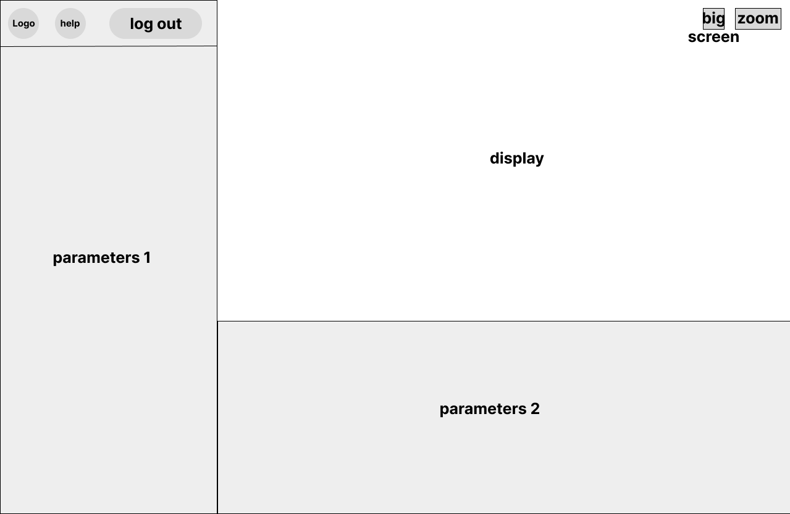
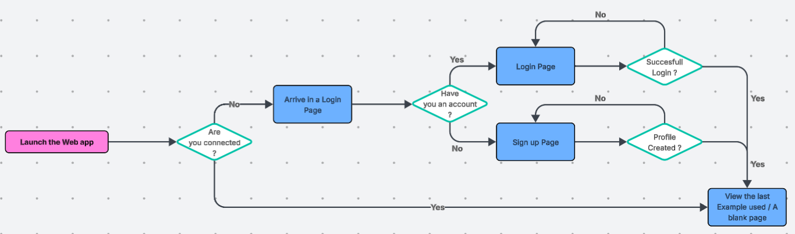
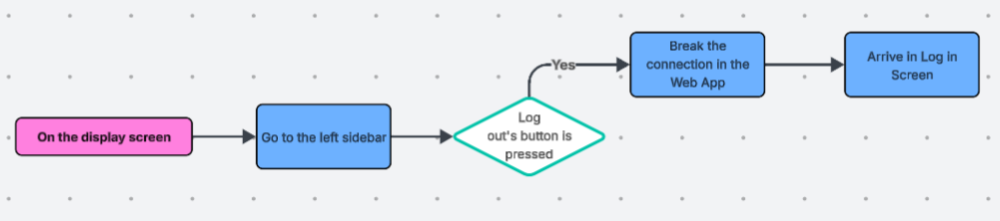
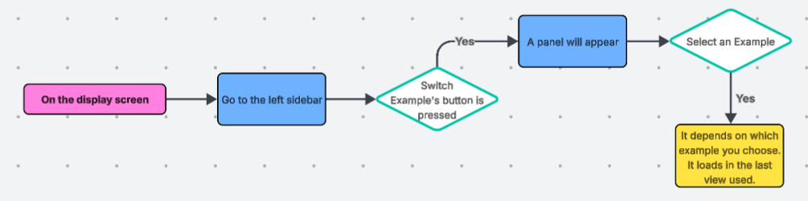
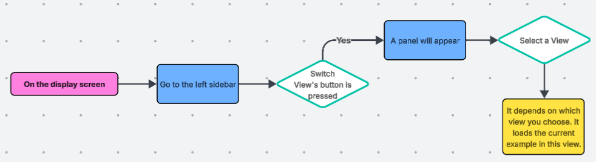
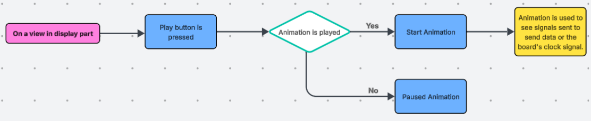
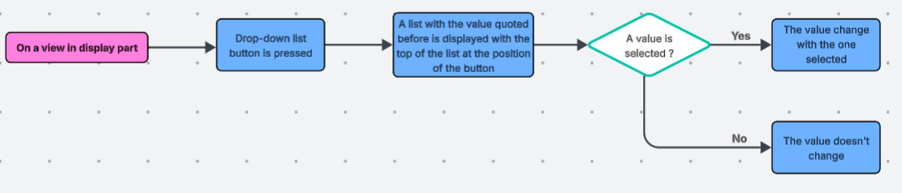

<h1 style='text-align: center'>Project's Name</h1>
<h2 style='text-align: center'> Functional Specification Document</h2>

---

<h3 style='text-align: center'>DOCUMENT VERSION 1.3</h3>
<h3 style='text-align: center'>02/28/2025</h3>

---

<h3>Author</h3>

| Name          | Role            |
| ------------- | --------------- |
| Alexis SANTOS | Program Manager |

<h3>Document History</h3>

| Date       | Version | Document Revision Description                                                                                                                                                                    |
| ---------- | :-----: | ------------------------------------------------------------------------------------------------------------------------------------------------------------------------------------------------ |
| 02/24/2025 |   1.0   | <li> Created the document and wrote sections Overview, A to E. </li> <li> Started the Glossary. </li>                                                                                            |
| 02/25/2025 |   1.1   | After meeting with the client, some parts have been updated. <li>Filled customers-relative sections</li> <li>Partially wrote Functional Requirements.</li> <li>Added Expected Deliverables.</li> |
| 02/27/2025 |   1.2   | Made a lot of corrections and rewriting to have a clear document.                                                                                                                                |
| 02/28/2025 |   1.3   | <li>Added the Test Cases Analysis</li> <li>Added Personas</li>                                                                                                                                   |

<h3>Approvals</h3>

| Approval   Date | Approved   Version | Approver   Role | Approver   Name | Approvement   Status |
| ------------------ | --------------------- | ------------------ | ------------------ | ----------------------- |
|                    |                       |                    |                    |                         |
|                    |                       |                    |                    |                         |
|                    |                       |                    |                    |                         |

---

 

Table of Content

- [I. Overview](#i-overview)
  - [A. Purpose of the document](#a-purpose-of-the-document)
  - [B. Project Scope](#b-project-scope)
  - [C. Deliverables](#c-deliverables)
  - [D. Project Organisation](#d-project-organisation)
    - [Project Representatives](#project-representatives)
    - [Stakholders](#stakholders)
    - [Project Roles](#project-roles)
    - [Expected Deliverables](#expected-deliverables)
  - [E. Project Plan](#e-project-plan)
    - [Milestones](#milestones)
    - [Ressources / Financial Plan](#ressources--financial-plan)
- [II. Requirements](#ii-requirements)
  - [A. Functional Requirements](#a-functional-requirements)
    - [FPGA Simulator](#fpga-simulator)
      - [Teacher View / Backend](#teacher-view--backend)
      - [Student View / Frontend](#student-view--frontend)
    - [Three Views](#three-views)
      - [All Views](#all-views)
      - [Shematics Representation](#shematics-representation)
      - [Signals Graph](#signals-graph)
      - [FPGA board's Schematic](#fpga-boards-schematic)
    - [Personas Definition](#personas-definition)
    - [Use Cases Analysis](#use-cases-analysis)
- [Glossary](#glossary)

---

# I. Overview

Our client, Florant MANNI has solicited us to develop a web interface for an FPGA Simulator[^1]. This web interface will be used to teach people how the signals spread inside an FPGA[^2]. For simplicity, we will represente the board with differents views (define in the document) to understand the FPGA system through animations. Those animations mainly symbolize signals transfers. 

## A. Purpose of the document

The purpose of this document is to outline the requirements and design considerations for developing a web interface for an FPGA Simulator[^1]. This interface aims to provide an educational tool that visually demonstrates how signals spread within an FPGA system, enhancing users' understanding of FPGA behavior.

The document will detail the functionalities needed to merge a 2D floorplan representation of an FPGA with the dynamic propagation of signals over time. This includes integrating the layout resulting from synthesis[^3] and place-and-route (P&R)[^4] processes with timing simulation data. The goal is to create an interactive and intuitive platform that allows users to observe and analyze signal propagation using a testbench[^5] and timing netlist[^6], both written in Verilog[^7].

By defining the scope, features, and user interactions, this specification will serve as a comprehensive guide for the development team to ensure the final product meets the educational objectives and technical requirements.

## B. Project Scope 

The project scope for developing the web interface[^8] for the FPGA Simulator includes the following key components and functionalities:

1. 2D floorplan Visualization:

   * Develop a graphical representation of the **FPGA layout**, displaying the arrangement of basic elements (BELs)[^9] and their interconnections.
   * Ensure the layout accurately **reflects** the post-synthesis and place-and-route (P&R) design.

 

2. Signal Propagation Simulation:
   
   * Integrate a timing simulator to **visualize** the propagation of clock signals within the FPGA through an animation.
   * Use a testbench and timing netlist, both written in Verilog, to drive the simulation and **demonstrate signal** behavior over time.

 

3. Double Interface:

   * A web interface used by students to interact with the web app[^10] to **explore** and **understand** the system.
   * A backend interface[^11] used by teachers to provide scripts to the program to train students with the web interface.

   

4. Interactive User Interface:

   * Create an **intuitive** web interface that allows users to interact with the with the view and observe signal propagation. //
   * Include controls for **starting**, **pausing**, and **resetting** the simulation, as well as options to inspect signal states at specific points in time.

 

5. Educational Features:

   * Implement features that enhance learning, such as tooltips, annotations to explain FPGA concepts and signal behavior.
   * Provide options for users to **load different FPGA designs** and testbenches to explore various scenarios.

 

6. Technical Requirements:

    * Ensure the web interface is **compatible** with modern **web browsers** and responsive to different screen sizes.
    * Optimize performance to handle complex FPGA designs.
    * **If share on the web**, implement security measures to protect user data and ensure the integrity of the simulation environment.

 

7. Testing and Validation:

   * Conduct thorough testing to validate the accuracy of the signal propagation simulation and the usability of the interface.

 

By focusing on these components, the project aims to deliver a comprehensive and interactive web interface that effectively teaches users about FPGA signal propagation.

## C. Deliverables

| Name                               | Type                                 | Deadline     | Link                                                       |
| ---------------------------------- | ------------------------------------ | ------------ | ---------------------------------------------------------- |
| Functional Specifications Document | Document (Markdown)                  | 03/13/2025   | [functionalSpecifications.md](functionalSpecifications.md) |
| Technical Specifications Document  | Document (Markdown)                  | 03/25/2025   | [technicalSpecifications.md]()                             |
| Test Plan Document                 | Document (Markdown)                  | 03/25/2025   | [testPlan.md]()                                            |
| Development                        | Programing (HTML / CSS / JavaScript) | 04/01/2025   |                                                            |
| Weekly Reports                     | Document (Markdown)                  | Every Friday | [Weekly Report Folder](Management/WeeklyReport)            |

## D. Project Organisation

### Project Representatives

| Project Owner | Represented by...                              |
| ------------- | ---------------------------------------------- |
| Florant MANNI | Represented by himself                         |
| Loïc NOGUES   | Represented by Alexis SANTOS (Program Manager) |

* Defining the vision and high-level objectives for the project.
* Approving the requirements, timetable, resources, and budget (if necessary).
* Authorizing the provision of funds/resources (internal or external) (if necessary).
* Approving the functional and technical specifications written by the team.
* Ensuring that major business risks are identified and managed by the team.
* Approving any major changes in scope.
* Receiving Project Weekly Reports and taking action accordingly to resolve issues escalated by the Project Manager.
* Ensuring business/operational support arrangements are put in place.
* Ensuring the participation of a business resource (if required).
* Providing final acceptance of the solution upon project completion.

### Stakholders

| Stakeholder      | Might have/find an interest in...                                                      |
| ---------------- | -------------------------------------------------------------------------------------- |
| Florant MANNI    | Needs a tool to help him to explain Verilog/VHDL system to young FPGA users.           |
| ALGOSUP Students | Learning the association between web languages (HTML/CSS/JavaScript)[^12] and Verilog. |

### Project Roles

As defined at the beginning, the team is arranged as follows: 

| Role              | Description                                                                                                                                                           | Name             |
| ----------------- | --------------------------------------------------------------------------------------------------------------------------------------------------------------------- | ---------------- |
| Project Manager   | Responsible for organization, planning, and budgeting.   Keeps the team motivated.                                                                                 | Loïc NOGUES      |
| Program Manager   | Ensures the project meets expectations.  Responsible for writing the Functional Specifications.                                                                    | Alexis SANTOS    |
| Technical Leader  | Makes technical decisions in the project.   Translates the Functional Specification into Technical Specifications.   Conducts code reviews.                     | Yann-Maël BOUTON |
| Software Engineer | Writes the code.   Participate in the technical design.                                                                                                            | Lucas MEGNAN     |
| Quality Assurance | Tests all functionalities of the product to find bugs and issues.   Documents bugs and issues.   Writes the test plan.   Checks that issues have been fixed. | Mathis LEBEL     |
| Technical Writter | Writes the user manual.   Participate in the technical design.                                                                                                     | Grégory PAGNOUX  |

### Expected Deliverables

For this project, the customer has requested us to meet the following deliverables:
* The source code need to be on a Git repository.
* An explainaton of how to run the software must be present on the repository and/or in the website.
* An explaination of how to add an application example must be present on the repository and/or in the website.
* The website must include at least two application examples:
  * One for the flipflop[^13].
  * One for the LUT4[^14]. 

## E. Project Plan 

### Milestones

| Milestones                   | Deadline   |
| ---------------------------- | ---------- |
| Functional Specifications V1 | 03/13/2025 |
| Technical Specifications V1  | 03/25/2025 |
| End of Development           | 04/01/2025 |
| Oral Presentation            | 04/04/2025 |

### Ressources / Financial Plan

We have an estimated total of 70 man-hours to complete this project. We have access to the following resources:

* The team (6 people)
* Teachers
* A computer per team member 

This project focuses on creating an animation of an FPGA Simulator to explain how an FPGA system works.

# II. Requirements

## A. Functional Requirements

This project focuses on creating an **animation** of an FPGA Simulator to explain how an FPGA system works.

### FPGA Simulator

The project is based on an FPGA simulator. This one needs to follow these requirements: 
* A 2D floor plan with three views.
* The ability to see the path taken by signals in the board

However, the client requested two views/main functionalities on this website/web app: The student view and the teacher view.

#### Teacher View / Backend

The teacher views is to be used by the teacher for severals reason: 

-  The ability to add another example with their own Verilog file.
-  Access to a testbench.

#### Student View / Frontend

The student view allows the student to explore and discover FPGA properties and functionalities. However, this view needs to follow these requirements: 

- The 2D view of FPGA Simulator. 
- Navigation within the view with zoom and move functionality. 
- Selection of the default example or the teacher's example and viewing it in a specific view. 
- Selection of one of the three view :the components schematic, binary graphic or board.
- A play button to pause or resume the animation.
- A button to select the speed of the animation.

### Three Views

To provide a comprehensive amount of information, the student needs access to three views: a schematic representation of components, a graph of signals, and an FPGA board's schematic.

#### All Views

In this three views, the user has the following features :

| 2D View & Navigation                                                                                                                              | Time Control                                                                                                                                                                                                                                                 | Example used & Visualization                                                                                                                                                                   |
| ------------------------------------------------------------------------------------------------------------------------------------------------- | ------------------------------------------------------------------------------------------------------------------------------------------------------------------------------------------------------------------------------------------------------------ | ---------------------------------------------------------------------------------------------------------------------------------------------------------------------------------------------- |
| <li>Navigate trough the screen with delimitation. </li> <li>Zoom on the screen to see more details or zoom out to view the global schematic.</li> | <li>Pause and resume button to stop or continue the animation.</li> <li>Controller/button to select the speed of the animation with the following choices:   
 0.25 / 0.5 / 0.75 / 1 / 1.25 / 1.5 / 1.75 / 2. 
</li> | <li>Choose the exercise between the default example and the example from the file provided by the teacher </li> <li>Select which view to display information from among the three views. </li> |

To organize the screen, we'll follow the model below. 

For the next three views, they will displayed on the display part.

#### Shematics Representation

   

   

   

   The schematic view is a 2D diagram representing components such as flip-flops, BRAMs, or LUT4s. The aim of this view is to understand how data and clock signals move through the components and how the program interacts with them from start to finish.

   The movement of data and clock signals is illustrated through animation. For each component, the following information must be displayed:

   <li>The type of component (LUT, BRAM, Clock, etc.)</li>
   <li>The ID of the component (e.g., Q1, Clk, etc.)</li>
   <li>Inputs and outputs</li>
    
   Additionally, the following information must be displayed between components:

   <li>The delay in signal transmission from one component to another</li>
   <li>The type of data being transferred (clock, status, etc.)</li>
   

 

#### Signals Graph

   
   

   

   FPGAs, like other digital systems, use the binary system. Each component has a binary state or is used to change the binary state. Therefore, it is important to monitor the status of these components.   With this view, we should be able to see the clock status and the status of each component. This would be useful for observing how many clock cycles each step of the program takes. With this information, students can better understand why certain events occur.
   

 

#### FPGA board's Schematic

   
   

   

   The FPGA board's schematic is a 2D floorplan used by the student to understand how the program sends data and clock signals.   
   In this view, the student needs the following features: 
   <li>An animation to show these clock and data signals.</li>
   <li>Differents color between data and clock signals to distinguish them.</li>
   <li>Components used by the program would by glowed.</li>

    
   However, in the conception of the schematic, we need to strike the best balance between reality and schematic representation to make it realistic and user-friendly.
   

 
 
 ### Personas Definition

<h4>Florent Manni</h4>

* **About**
  * **Job Title**: Electronic Engineer for over 20 years
  * **Experience**: 20 years of experience

* **Description**
  * Florent Manni is a Senior Electronic Engineer who has requested the team to develop the project. He has extensive experience in FPGA engineering. Typically, he teaches junior engineers the FPGA system to enhance their productivity. He has requested this tool to upgrade his support capabilities.  

<h4>Alexandra Dupont</h4>

* **About**
  * **Job Title**: Junior Electronic Engineer
  * **Experience**: 
    * Recently graduated with a Bachelor's degree in Electrical Engineering
    * Limited hands-on experience with FPGA, but eager to learn and grow in the field.
* **Description**:
  * Alex is a recent graduate who has joined the team as a Junior Electronic Engineer. With a strong foundation in electrical engineering concepts, she is excited to dive into the world of FPGA. Alex is highly motivated and eager to learn from experienced colleagues like Florant Manni. She is looking forward to contributing to innovative projects and expanding her skill set in FPGA design and implementation. 

### Use Cases Analysis

<h4>Start the Web App</h4> 

When we start the Web app, firstly the program check if you are connected. If yes, you look at your last example used. If not, you arrive in a log in/sign up page.

<h4>Log out</h4>

Above the sidebar located in parameter 1 of the model, we have a `log out button`. If we press it, we should be disconnected and a login page should be displayed.

<h4>Switch Example</h4>

A sidebar located in parameter 1 of the model should have a lot of functionalities. One of them is the button `Switch Example`. With it, the user should select one of default examples or the teacher example.

<h4>Switch View</h4>

The sidebar should have a button `Switch View`. With it, the user should select one of those three views.

<h4>Animation</h4>

The project's goal is to have an animation to illustrate program action. So, with a `play button`, we should be allowed to pause and resume animation.

<h4>Animation Speed</h4>

Near to the play button, we should have a `drop-down list`. With it, the animation speed up or slow down. We should be allowed to select the speed between this speed values : 0.25, 0.5, 0.75, 1, 1.25, 1.5, 1.75, 2. The **default value** is x1.

# Glossary

[^1]: An FPGA Simulator is a tool that helps designers test digital circuits before they are built. It uses special languages like Verilog or VHDL to simulate how signals move through an FPGA, ensuring everything works correctly.

[^2]: An FPGA (Field-Programmable Gate Array)  is an integrated circuit with basic elements and preconfigured electrical signal routes between them.

[^3]: Translation of the application into an electrical equivalent. It creates a netlist (which can be exported as a netlist). 

[^4]: Place and Route is the packing of the netlist component in the FPGA available BEL (Place). Then a route for signals between each BEL is selected (Route). A timing netlist is created and can be exported in verilog.

[^5]: A testbench is a crucial tool in the design and verification process, helping to ensure that digital circuits and systems function correctly before they are manufactured.

[^6]: A netlist is like a recipe for building an electronic circuit. It tells you what components you need and how to put them together (connections) to create a functioning circuit.

[^7]: Verilog is a language used to program a system using the FPGA layout. It use to writting instruction to the system.

[^8]: A web interface is a user-friendly website or online tool that lets you interact with a system or application through your web browser. It's like a control panel on the internet where you can click buttons, enter information, and see results without needing special software.

[^9]: These are the hardware electrical ressources available inside the FPGA like fliflop, Look-Up-Table (LUT), Block RAM....

[^10]: A web app is like a website that you can interact with, it like an application you can use on your phone, hence instead of use an application store to download it, you use it through a web browser like Chrome or Safari.

[^11]: A backend interface is a part of a software application working behing the display. In this case, that indicate a part of the software where the teacher could add an example with a Verilog file.

[^12]: HTML, CSS and JavaScript are pagramations languages usually used for the web. It is what we use for this project.  

[^13]: 

[^14]: 